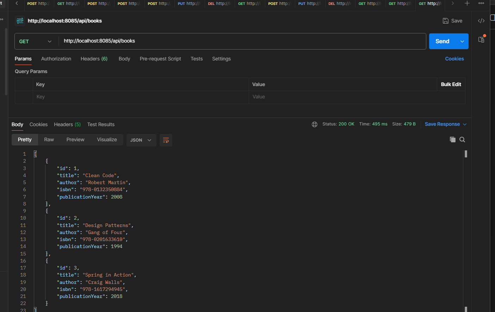
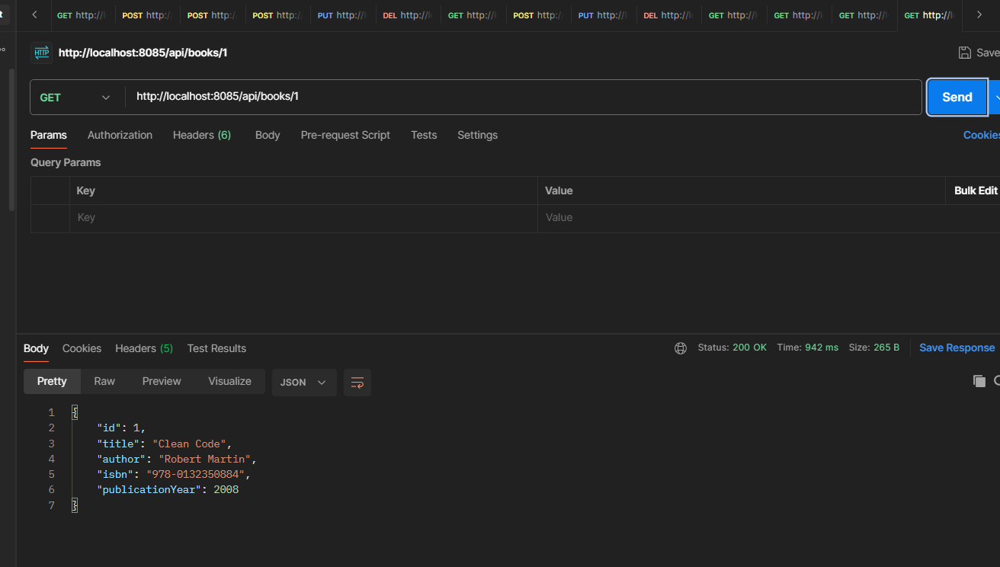
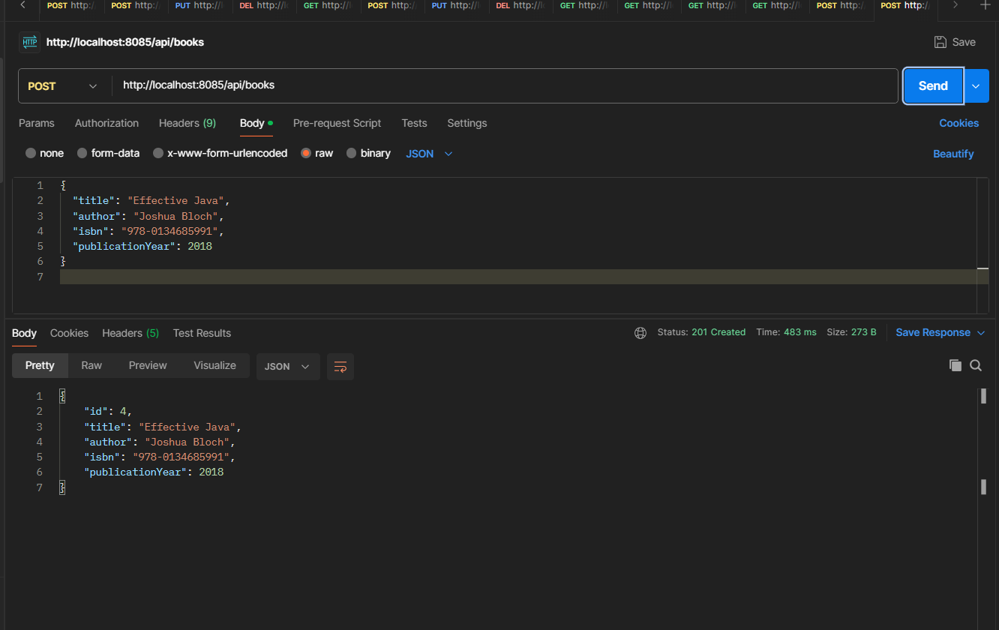
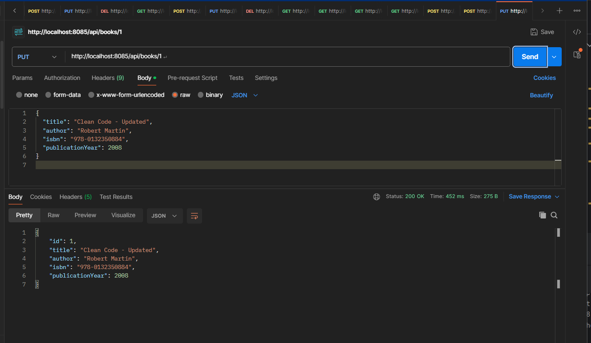
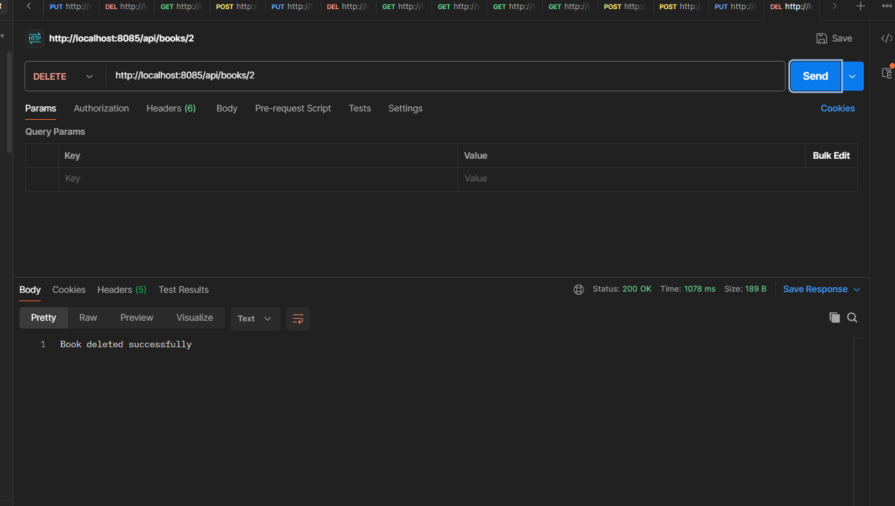

# Question 1 – Library Book Management REST API

## Project Overview

This project is a simple RESTful API developed using Spring Boot.  
It allows users to manage books in a library system by performing basic CRUD operations.

### Application Details
- **Server Port:** 8085
- **Base URL:** `http://localhost:8085/api/books`
- **Base Package:** `auca.ac.rw.question1_library_api`

---

## Available API Endpoints

### 1. Retrieve All Books

**Endpoint:**  
`GET /api/books`

**Description:**  
Returns a list of all books currently stored in the system.

**Response:** `200 OK`

```json
[
  {
    "id": 1,
    "title": "Clean Code",
    "author": "Robert Martin",
    "isbn": "978-0132350884",
    "publicationYear": 2008
  }
]
```

**Screenshot:**  


---

### 2. Retrieve Book by ID

**Endpoint:**  
`GET /api/books/{id}`

**Description:**  
Fetches a single book based on its unique ID.

**Example:**  
`GET /api/books/1`

**Response:** `200 OK` (if found)  
`404 NOT FOUND` (if book does not exist)

**Screenshot:**  


---

### 3. Create a New Book

**Endpoint:**  
`POST /api/books`

**Description:**  
Adds a new book to the library collection.

**Request Body:**

```json
{
  "title": "Effective Java",
  "author": "Joshua Bloch",
  "isbn": "978-0134685991",
  "publicationYear": 2018
}
```

**Response:**  
`201 CREATED` (Returns the created book including generated ID)

**Screenshot:**  


---

### 4. Update an Existing Book

**Endpoint:**  
`PUT /api/books/{id}`

**Description:**  
Updates the details of an existing book using its ID.

**Example:**  
`PUT /api/books/1`

**Request Body:**

```json
{
  "title": "Clean Code - Updated",
  "author": "Robert Martin",
  "isbn": "978-0132350884",
  "publicationYear": 2008
}
```

**Response:**  
`200 OK` (if updated successfully)  
`404 NOT FOUND` (if book does not exist)

**Screenshot:**  


---

### 5. Delete a Book

**Endpoint:**  
`DELETE /api/books/{id}`

**Description:**  
Removes a book from the system based on its ID.

**Example:**  
`DELETE /api/books/2`

**Response:**  
`200 OK`
```
Book deleted successfully
```

**Screenshot:**  


---

## How to Run the Application

1. Open a terminal and navigate to the project directory:

```bash
cd question1-library-api/question1-library-api
```

2. Start the Spring Boot application using Maven Wrapper:

```bash
.\mvnw.cmd spring-boot:run
```

3. The application will start on:

```
http://localhost:8085
```

---

## API Testing

You can test all endpoints using:

- Postman
- Thunder Client
- curl
- Any REST client

Base endpoint for testing:

```
http://localhost:8085/api/books
```

---

## Technologies Used

- Java 21
- Spring Boot 4.0.2
- Spring Web
- Maven
- RESTful API Architecture
