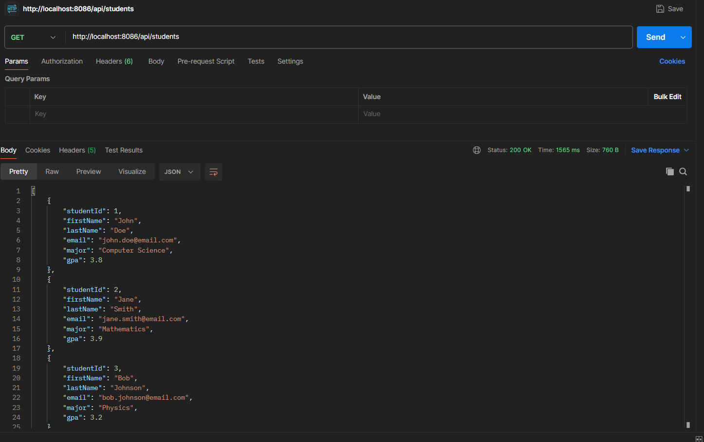
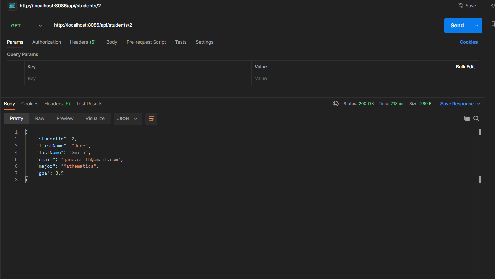
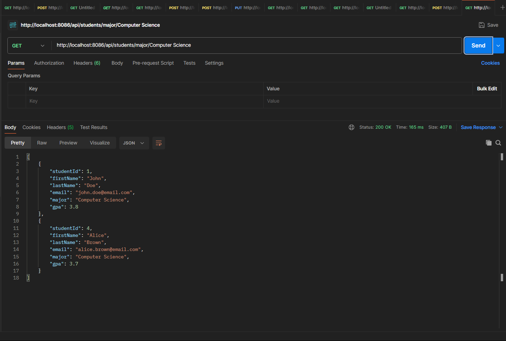
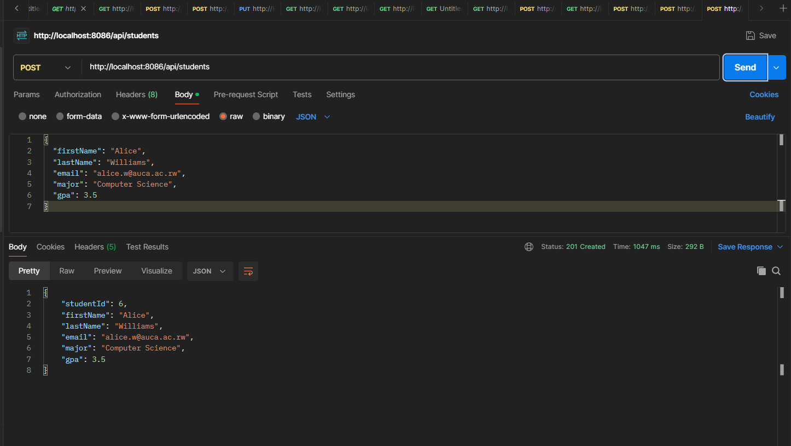
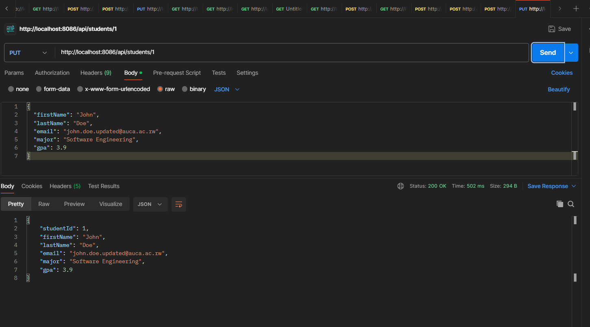
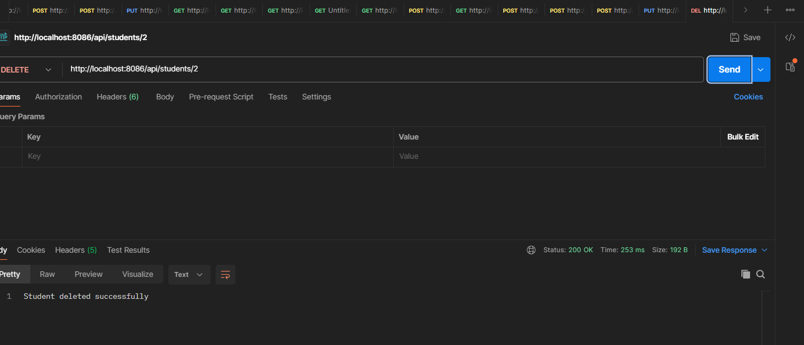

# Question 2: Student Management REST API

## Application Details
- **Server Port**: 8086
- **API Base Path**: `http://localhost:8086/api/students`
- **Java Package**: `auca.ac.rw.question2_student_api`

## Available REST Endpoints

### 1. Retrieve All Students
**HTTP Method & Path**: `GET /api/students`  
**Purpose**: Fetches the complete list of registered students.  
**Success Response**: 200 OK

**Sample Response Body**:
```json
[
  {
    "studentId": 1,
    "firstName": "John",
    "lastName": "Doe",
    "email": "john.doe@auca.ac.rw",
    "major": "Computer Science",
    "gpa": 3.8
  }
]
```

**Documentation**:  


---

### 2. Retrieve Student by Identifier
**HTTP Method & Path**: `GET /api/students/{id}`  
**Purpose**: Fetches details of a single student using their unique ID.  
**Sample Request**: `GET /api/students/1`  
**Success Response**: 200 OK

**Documentation**:  


---

### 3. Retrieve Students by Academic Major
**HTTP Method & Path**: `GET /api/students/major/{major}`  
**Purpose**: Returns all students studying a particular major.  
**Sample Request**: `GET /api/students/major/Computer Science`  
**Success Response**: 200 OK

**Documentation**:  



### 4. Create New Student Record
**HTTP Method & Path**: `POST /api/students`  
**Purpose**: Adds a new student to the registration system.

**Sample Request Body**:
```json
{
  "firstName": "Alice",
  "lastName": "Williams",
  "email": "alice.w@auca.ac.rw",
  "major": "Computer Science",
  "gpa": 3.7
}
```

**Success Response**: 201 Created (includes auto-generated student ID)

**Documentation**:  


---

### 5. Modify Existing Student Information
**HTTP Method & Path**: `PUT /api/students/{id}`  
**Purpose**: Updates information for an existing student record.  
**Sample Request**: `PUT /api/students/1`

**Sample Request Body**:
```json
{
  "firstName": "John",
  "lastName": "Doe",
  "email": "john.doe.updated@auca.ac.rw",
  "major": "Software Engineering",
  "gpa": 3.9
}
```

**Success Response**: 200 OK

**Documentation**:  


---

### 6. Remove Student Record
**HTTP Method & Path**: `DELETE /api/students/{id}`  
**Purpose**: Permanently removes a student from the registration system.  
**Sample Request**: `DELETE /api/students/3`  
**Success Response**: 200 OK with message "Student deleted successfully"

**Documentation**:  


---

## Running the Application

### Step 1: Navigate to Project Directory
```bash
cd question2-student-api
```

### Step 2: Launch the Application
**For Windows**:
```bash
.\mvnw.cmd spring-boot:run
```

**For Mac/Linux**:
```bash
./mvnw spring-boot:run
```

### Step 3: Verify Application Status
The application will initialize and listen on **port 8086**

---

## API Testing

You can test these endpoints using:
- **Postman** (recommended)
- **cURL**
- **Any HTTP client**

**Base URL for all requests**: `http://localhost:8086/api/students`

---

## Technology Stack
- **Language**: Java 21
- **Framework**: Spring Boot 3.4.2
- **Dependencies**: Spring Web
- **Build Tool**: Maven

---

## Sample Data
The application initializes with 5 pre-loaded student records for testing purposes.