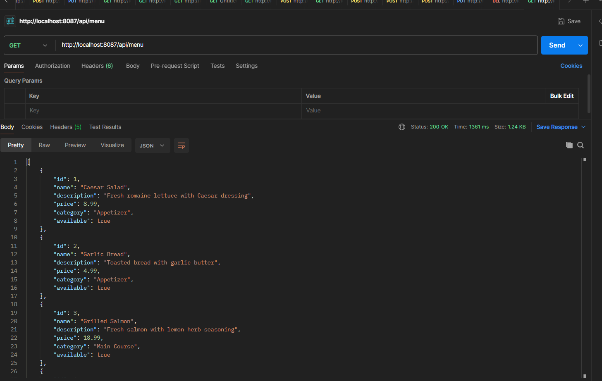
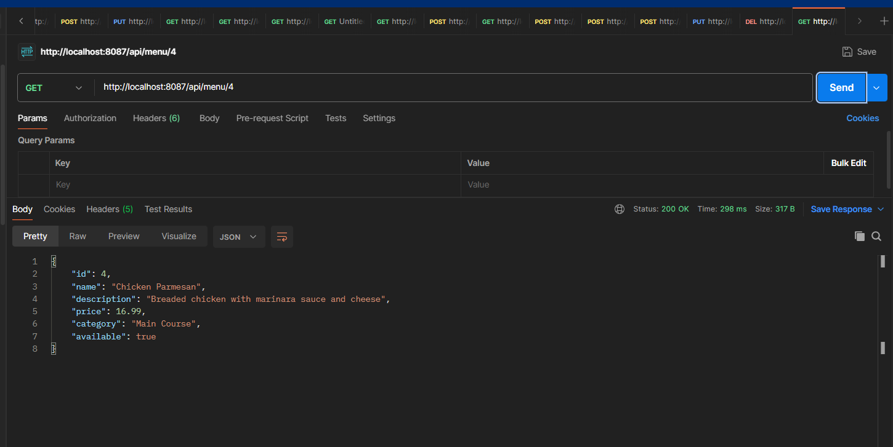
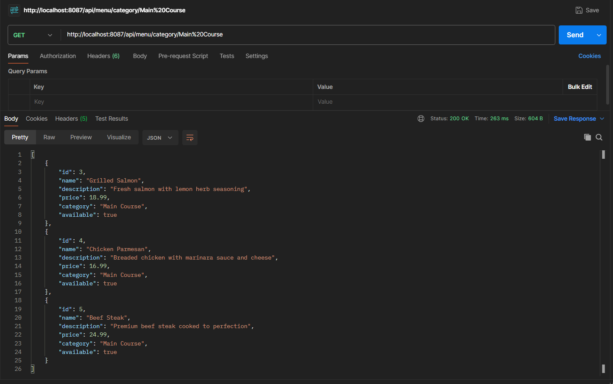
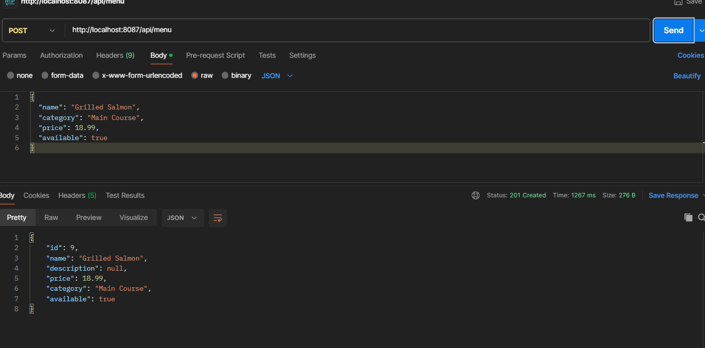
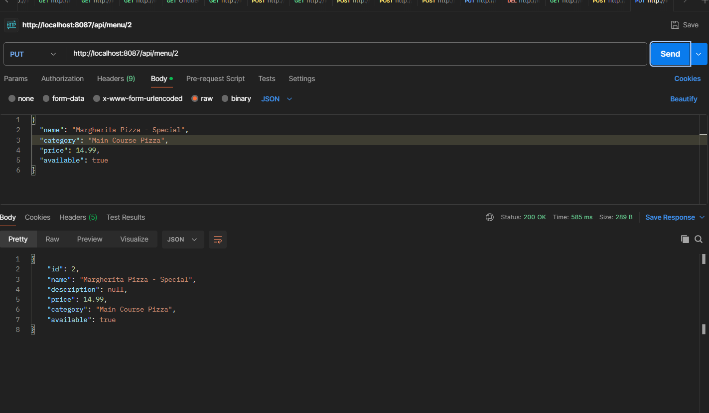
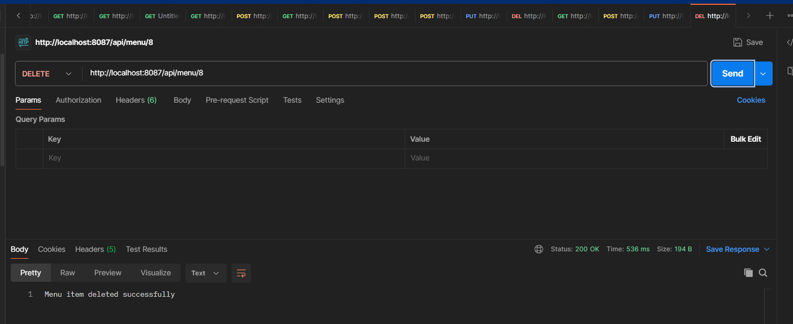

# Question 3: Restaurant Menu Management API

## Application Configuration
- **Server Port**: 8087
- **API Base Path**: `http://localhost:8087/api/menu`
- **Java Package**: `auca.ac.rw.question3_restaurant_api`

## Available REST Endpoints

### 1. Retrieve Complete Menu
**HTTP Method & Path**: `GET /api/menu`  
**Purpose**: Fetches all available items from the restaurant's menu.  
**Success Response**: 200 OK

**Sample Response Body**:
```json
[
  {
    "id": 1,
    "name": "Caesar Salad",
    "description": "Fresh romaine lettuce with Caesar dressing",
    "price": 8.99,
    "category": "Appetizer",
    "available": true
  }
]
```

**Documentation**:  


---)

---

### 2. Retrieve Menu Item by Identifier
**HTTP Method & Path**: `GET /api/menu/{id}`  
**Purpose**: Fetches details of a specific menu item using its unique ID.  
**Sample Request**: `GET /api/menu/1`  
**Success Response**: 200 OK

**Documentation**:  


---

### 3. Retrieve Menu Items by Food Category
**HTTP Method & Path**: `GET /api/menu/category/{category}`  
**Purpose**: Returns all menu items belonging to a particular category.  
**Sample Request**: `GET /api/menu/category/Main Course`  
**Available Categories**: Main Course, Appetizer, Dessert, Beverage  
**Success Response**: 200 OK

**Documentation**:  


---)

---


### 4. Add New Menu Item
**HTTP Method & Path**: `POST /api/menu`  
**Purpose**: Creates a new item in the restaurant menu.

**Sample Request Body**:
```json
{
  "name": "Grilled Salmon",
  "description": "Fresh salmon with lemon herb seasoning",
  "price": 18.99,
  "category": "Main Course",
  "available": true
}
```

**Success Response**: 201 Created (includes auto-generated item ID)

**Documentation**:  


---)

---

### 5. Modify Existing Menu Item
**HTTP Method & Path**: `PUT /api/menu/{id}`  
**Purpose**: Updates information for an existing menu item.  
**Sample Request**: `PUT /api/menu/1`

**Sample Request Body**:
```json
{
  "name": "Premium Caesar Salad",
  "description": "Premium romaine with homemade Caesar dressing",
  "price": 9.99,
  "category": "Appetizer",
  "available": true
}
```

**Success Response**: 200 OK

**Documentation**:  


---)

---


### 6. Remove Menu Item
**HTTP Method & Path**: `DELETE /api/menu/{id}`  
**Purpose**: Permanently removes a menu item from the system.  
**Sample Request**: `DELETE /api/menu/2`  
**Success Response**: 200 OK with message "Menu item deleted successfully"

**Documentation**:  


---)

---

## Running the Application

### Step 1: Navigate to Project Directory
```bash
cd question3-restaurant-api
```

### Step 2: Launch the Application

**For Windows**:
```bash
.\mvnw.cmd spring-boot:run
```

**For Mac/Linux**:
```bash
./mvnw spring-boot:run
```

### Step 3: Verify Application Status
The application will initialize and listen on **port 8087**

---

## API Testing

You can test these endpoints using:
- **Postman** (recommended)
- **cURL**
- **Any HTTP client**

**Base URL for all requests**: `http://localhost:8087/api/menu`

---

## Technology Stack
- **Language**: Java 21
- **Framework**: Spring Boot 3.4.2
- **Dependencies**: Spring Web
- **Build Tool**: Maven

---

## Menu Categories
The restaurant offers items across these categories:
- **Main Course**: Salmon, Chicken Parmesan, Beef Steak
- **Appetizer**: Caesar Salad, Garlic Bread
- **Dessert**: Chocolate Cake, Apple Pie
- **Beverage**: Coffee

---

## Sample Data
The application initializes with 8 pre-loaded menu items for testing purposes.