# Question 4: E-Commerce Product API

## Project Information
- **Port**: 8088
- **Base URL**: `http://localhost:8088/api/products`
- **Package**: `auca.ac.rw.question4_ecommerce_api`

## API Endpoints

### 1. GET All Products
**Endpoint**: `GET /api/products`

**Description**: Retrieves all products from the catalog.

**Response**: 200 OK
```json
[
  {
    "productId": 1,
    "name": "iPhone 15 Pro",
    "description": "Latest Apple smartphone with A17 chip",
    "price": 999.99,
    "category": "Electronics",
    "stockQuantity": 50,
    "brand": "Apple"
  }
]
```

**Screenshot**:
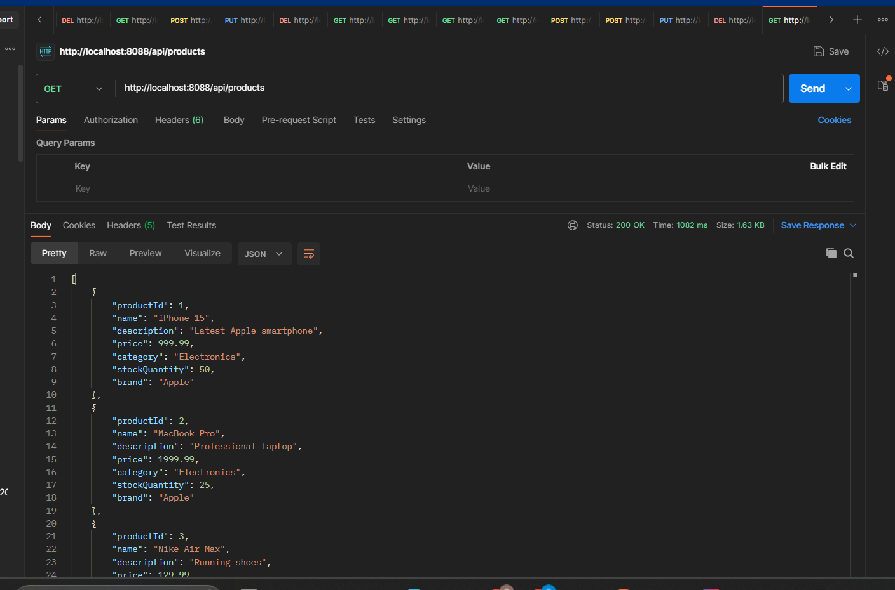

---

### 2. GET Product by ID
**Endpoint**: `GET /api/products/{productId}`

**Description**: Retrieves a specific product by its ID.

**Example**: `GET /api/products/1`

**Response**: 200 OK

**Screenshot**:
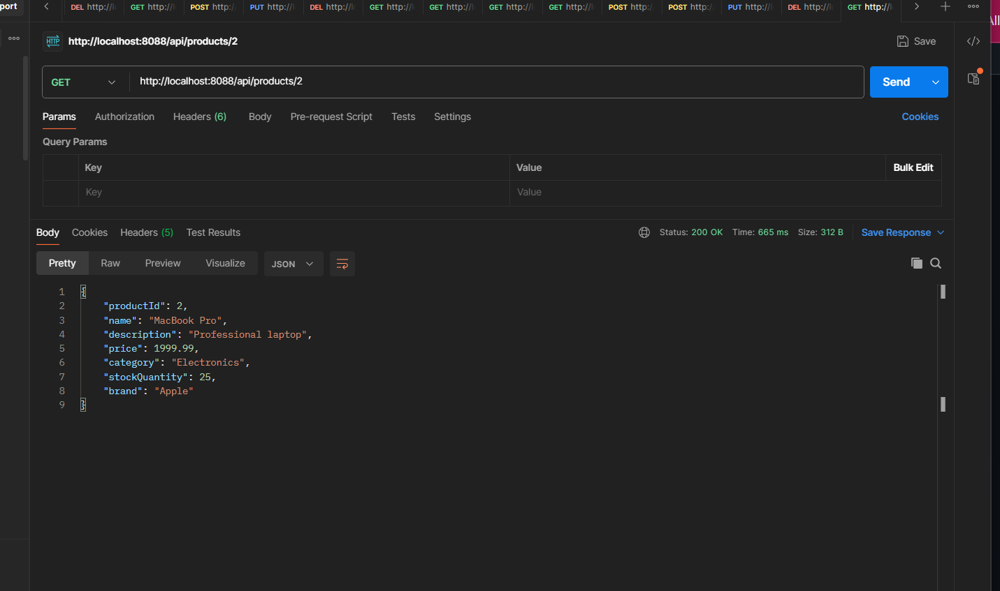

---

### 3. GET Products by Category
**Endpoint**: `GET /api/products/category/{category}`

**Description**: Retrieves all products in a specific category.

**Example**: `GET /api/products/category/Electronics`

**Categories**: Electronics, Computers, Audio, Footwear, Clothing

**Response**: 200 OK

**Screenshot**:
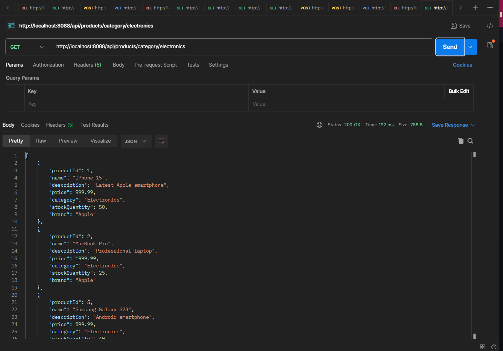

---

### 4. GET Products by Brand
**Endpoint**: `GET /api/products/brand/{brand}`

**Description**: Retrieves all products from a specific brand.

**Example**: `GET /api/products/brand/Apple`

**Brands**: Apple, Samsung, Dell, Sony, Nike, Adidas, Levi's, The North Face

**Response**: 200 OK

**Screenshot**:
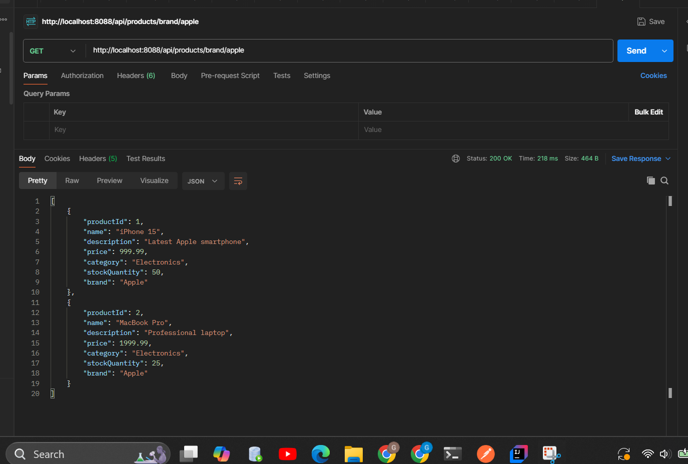

---

### 5. Search Products by Keyword
**Endpoint**: `GET /api/products/search?keyword={keyword}`

**Description**: Searches products by keyword in name or description.

**Example**: `GET /api/products/search?keyword=phone`

**Response**: 200 OK

**Screenshot**:
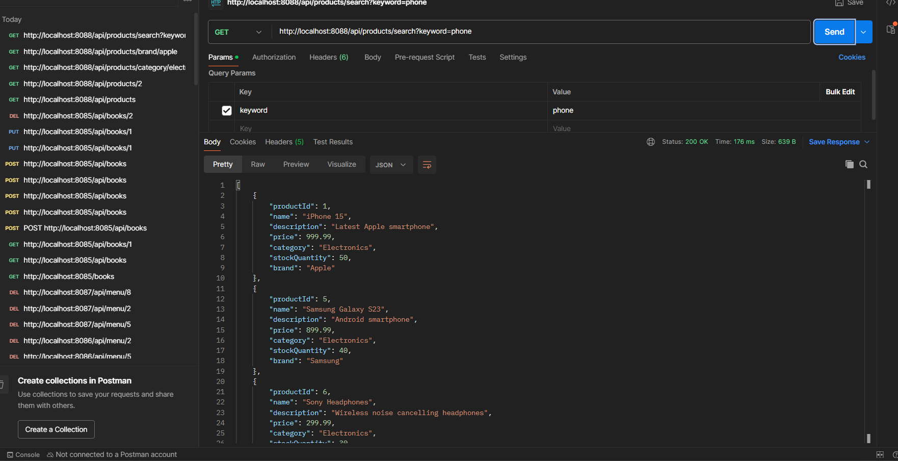

---

### 6. GET Products by Price Range
**Endpoint**: `GET /api/products/price-range?min={min}&max={max}`

**Description**: Retrieves products within a specified price range.

**Example**: `GET /api/products/price-range?min=100&max=500`

**Response**: 200 OK

**Screenshot**:
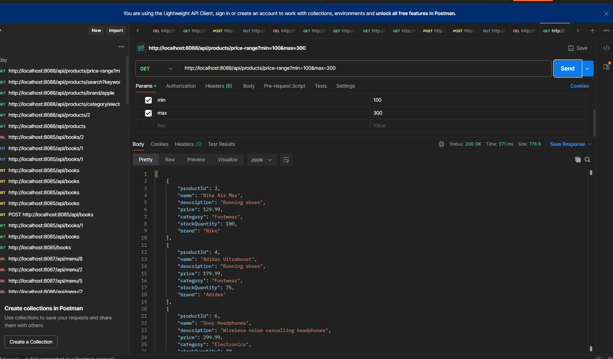

---

### 7. GET In-Stock Products
**Endpoint**: `GET /api/products/in-stock`

**Description**: Retrieves all products with stock quantity greater than 0.

**Response**: 200 OK

**Screenshot**:
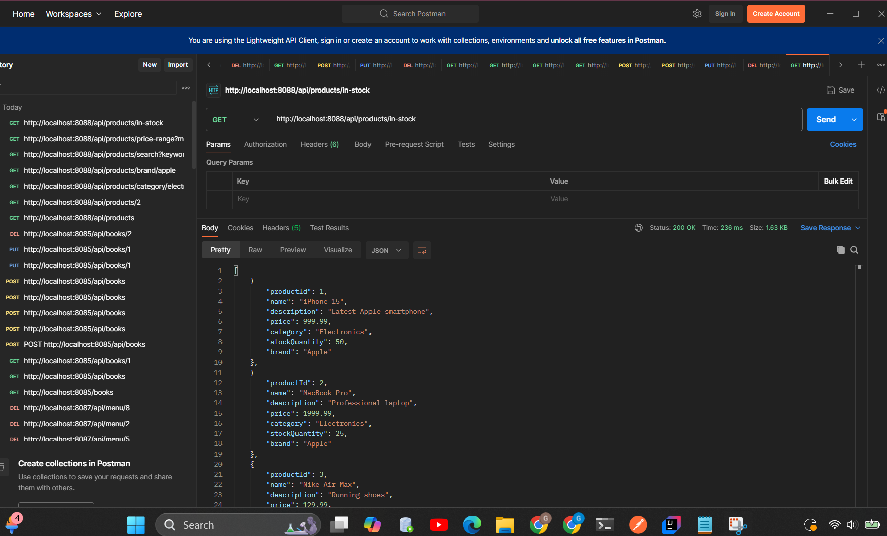

---

### 8. POST Create New Product
**Endpoint**: `POST /api/products`

**Description**: Adds a new product to the catalog.

**Request Body**:
```json
{
  "name": "iPad Air",
  "description": "Powerful tablet with M1 chip",
  "price": 599.99,
  "category": "Electronics",
  "stockQuantity": 50,
  "brand": "Apple"
}
```

**Response**: 200 OK (returns created product with ID)

**Screenshot**:
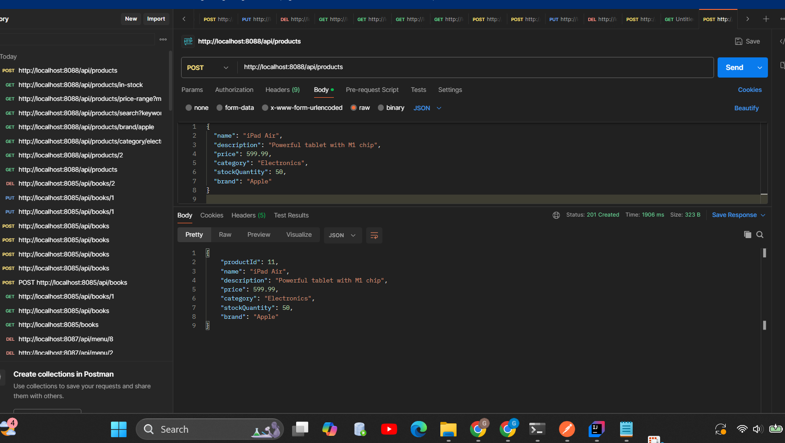

---

### 9. PUT Update Product
**Endpoint**: `PUT /api/products/{productId}`

**Description**: Updates an existing product.

**Example**: `PUT /api/products/1`

**Request Body**:
```json
{
  "name": "iPhone 15 Pro Max",
  "description": "Updated flagship smartphone with larger display",
  "price": 1099.99,
  "category": "Electronics",
  "stockQuantity": 75,
  "brand": "Apple"
}
```

**Screenshot**:
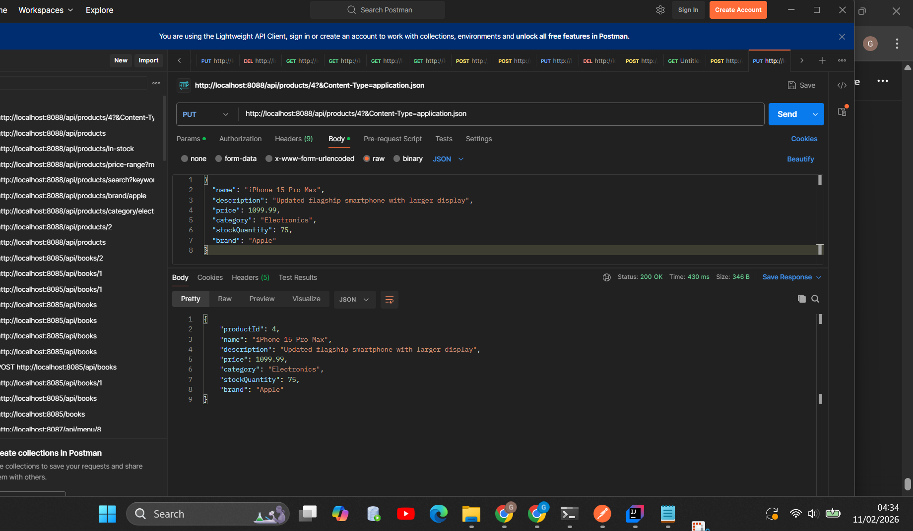

---

### 10. PATCH Update Stock Quantity
**Endpoint**: `PATCH /api/products/{productId}/stock?quantity={quantity}`

**Description**: Updates the stock quantity of a product.

**Example**: `PATCH /api/products/9/stock?quantity=100`

**Response**: 200 OK (returns updated product)

**Screenshot**:
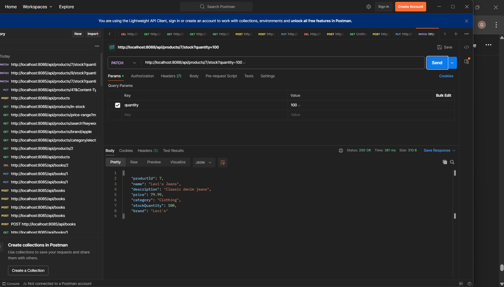

---

### 11. DELETE Product
**Endpoint**: `DELETE /api/products/{productId}`

**Description**: Removes a product from the catalog.

**Example**: `DELETE /api/products/10`

**Response**: "Product deleted successfully"

**Screenshot**:
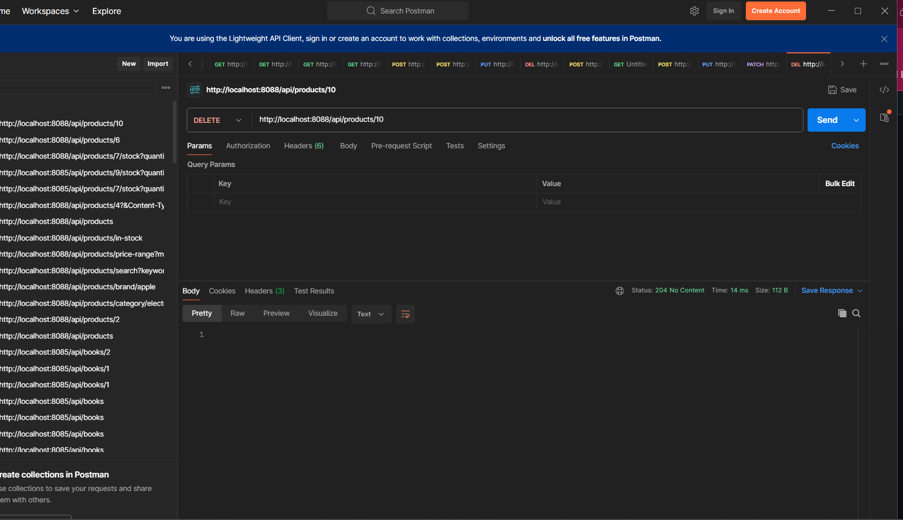

---

## How to Run

1. Navigate to project directory:
```bash
cd question4-ecommerce-api/question4-ecommerce-api
```

2. Run the application:
```bash
.\mvnw.cmd spring-boot:run
```

3. Application will start on port 8084

## Testing

Use Postman or any REST client to test the endpoints at:
`http://localhost:8088/api/products`

## Technologies Used
- Java 21
- Spring Boot 4.0.2
- Spring Web
- Maven

## Sample Product Categories
- **Electronics**: Smartphones, Tablets
- **Computers**: Laptops, Desktops
- **Audio**: Headphones, Earbuds
- **Footwear**: Running shoes, Sneakers
- **Clothing**: Jeans, Jackets