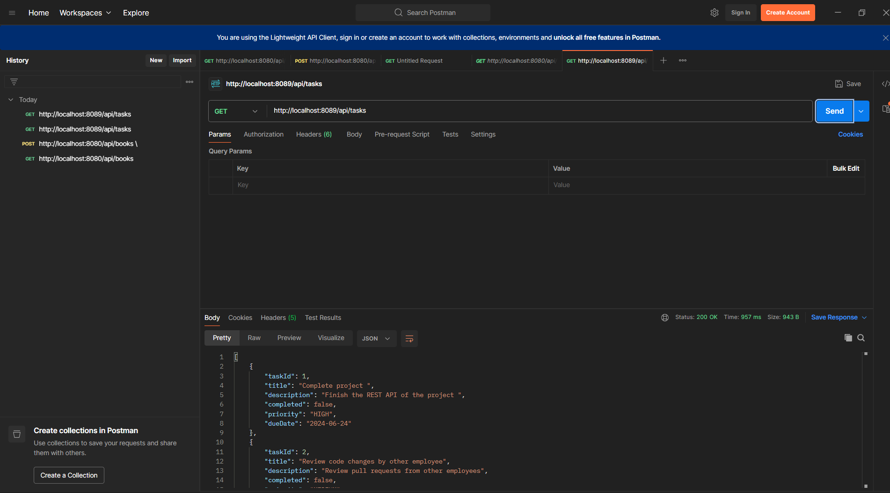
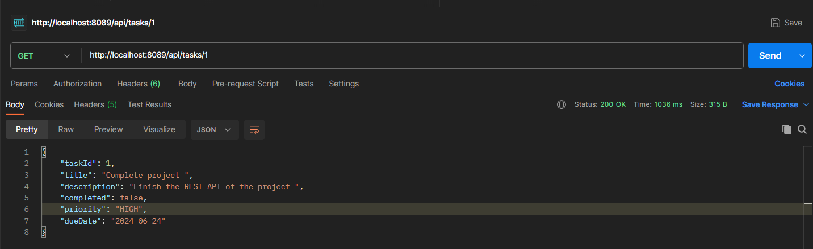
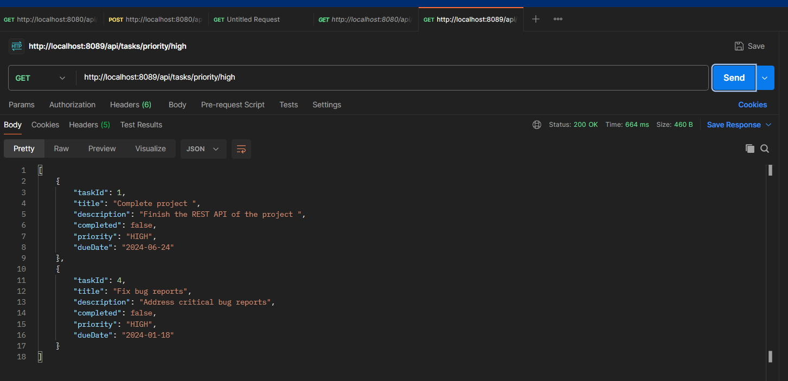
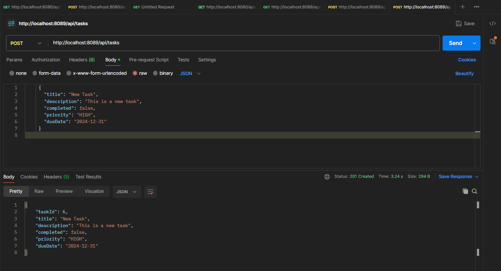

Question 5: Task Management API
Project Information
Port: 8089
Base URL: http://localhost:8089/api/tasks
Package: auca.ac.rw.question5_task_api
API Endpoints
1. GET All Tasks
   Endpoint: GET /api/tasks

Description: Retrieves all tasks.

Response: 200 OK

[
{
"id": 1,
"title": "Complete Project",
"description": "Finish the Spring Boot project",
"status": "IN_PROGRESS",
"priority": "HIGH",
"dueDate": "2026-02-15"
}
]

2. GET Task by ID
   Endpoint: GET /api/tasks/{id}

Description: Retrieves a specific task by its ID.

Example: GET /api/tasks/1

3.GET Tasks by Priority
   Endpoint: GET /api/tasks/priority/{priority}

Description: Retrieves tasks filtered by priority level.

Example: GET /api/tasks/priority/HIGH

Priorities: LOW, MEDIUM, HIGH

y

4.POST Create New Task
   Endpoint: POST /api/tasks

Description: Creates a new task.

Request Body:

{
"title": "Deploy Application",
"description": "Deploy to production server",
"status": "TODO",
"priority": "HIGH",
"dueDate": "2026-02-25"
}

5.PUT Update Task
   Endpoint: PUT /api/tasks/{id}

Description: Updates an existing task.

Example: PUT /api/tasks/1

6DELETE Task
   Endpoint: DELETE /api/tasks/{id}

Description: Deletes a task.

Example: DELETE /api/tasks/2

Response: "Task deleted successfully"

How to Run
cd question5-task-api/question5-task-api
.\mvnw.cmd spring-boot:run
Application will start on port 8085

Technologies Used
Java 21
Spring Boot 4.0.2
Spring Web
Maven